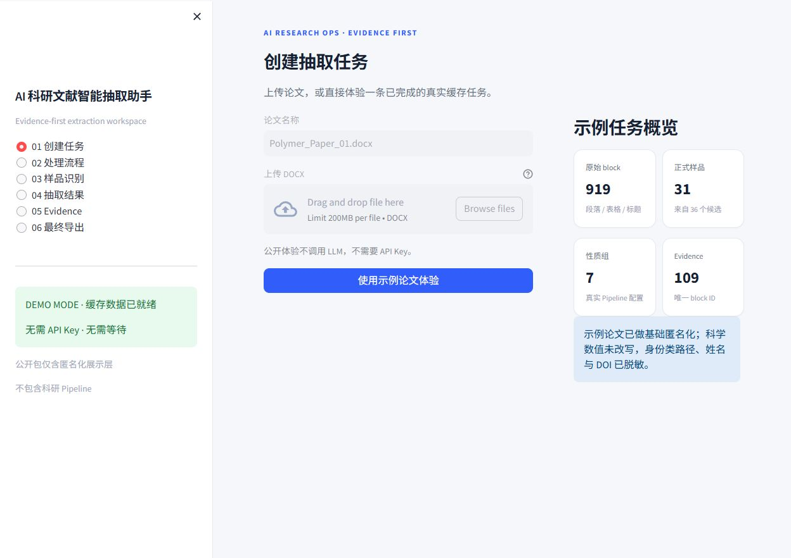
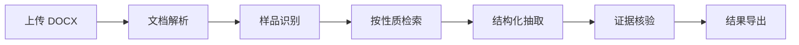
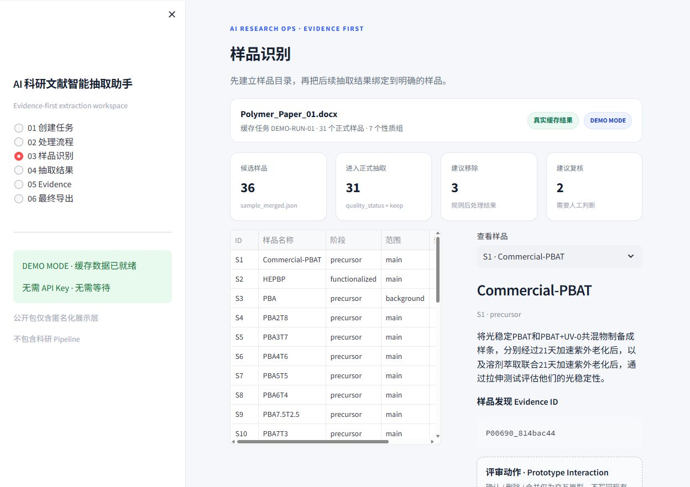
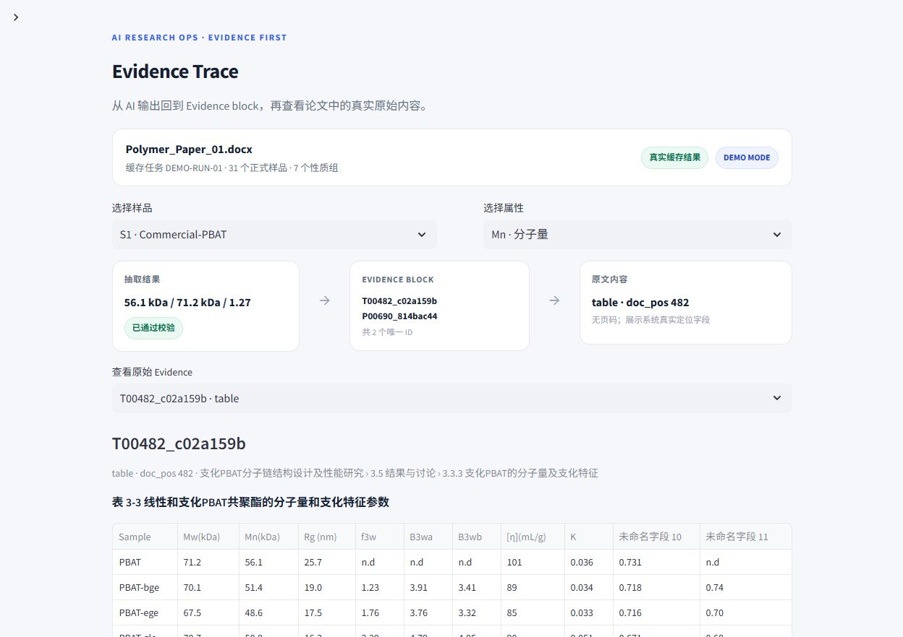
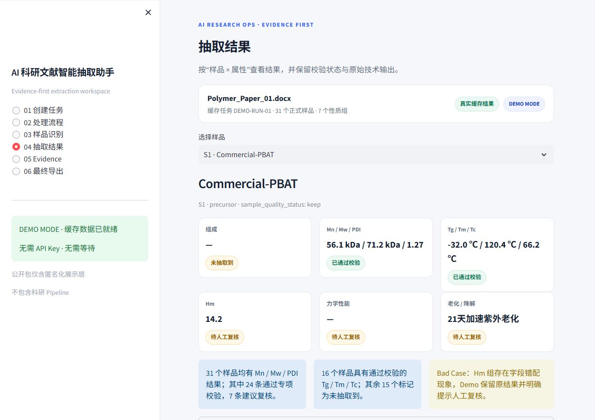

# AI 科研文献智能抽取助手

> 面向高分子科研文献的“证据优先”智能抽取 Demo

这是一个从真实科研需求出发完成的 AI 产品 Demo。它不是简单的“论文问答工具”，而是把 **文档解析 → 样品识别 → 证据检索 → 结构化抽取 → 结果核验 → 导出** 拆成一条可检查、可恢复、可追溯的工作流。

本仓库只包含**公开展示层 + 匿名化真实缓存数据**。原科研 Pipeline、原始论文、API Key、私有 Prompt 与本地路径均未公开。

<p align="center">
  
</p>

## 项目定位

高分子论文中的样品、组成、分子量、热性能与力学数据往往分散在正文、表格和不同章节中。人工整理不仅耗时，还需要反复确认“哪个值属于哪个样品、这个结果来自哪里”。

这个产品希望解决三件事：

- **让 AI 负责高重复工作**：找、筛、整理；
- **把关键判断留给人**：歧义、异常、最终确认；
- **让结果可以被核验**：每个关键结果都保留证据入口。

## 我在项目中负责什么

我从真实科研需求出发，完成了：

- 需求拆解与 MVP 边界定义；
- AI Workflow 设计与 Pipeline 联调；
- 样品识别、按性质检索与结构化抽取流程设计；
- Evidence Grounding 与结果可追溯设计；
- Bad Case 分析、验证状态设计与失败恢复思路；
- Figma 低保真原型与 Streamlit Web Demo 产品化展示。

## 产品流程



用户看到的是简化后的业务流程，底层仍由多阶段 Pipeline 完成处理。系统不会把 Stage、JSON 和脚本直接暴露给普通用户。

## 样品识别：AI 结果不是默认全部采用

一条真实运行中：

- 识别出 **36 个候选样品**；
- **31 个**进入正式抽取；
- **3 个**建议移除；
- **2 个**建议人工复核。

<p align="center">
  
</p>

这部分体现的产品原则是：**AI 先给建议，再通过状态和人工入口处理不确定结果，而不是把所有模型输出直接写入最终结果。**

## 一条真实运行的结果

| 指标 | 真实结果 |
|---|---:|
| 原始内容 Block | 919 |
| 候选样品 | 36 |
| 正式样品 | 31 |
| 性质组 | 7 |
| 唯一 Evidence ID | 109 |
| Evidence 可解析 | 109 / 109 |
| 性质抽取批次 | 21 / 21 成功 |

> “21 / 21 成功”表示本次抽取批次执行完成，不代表结果准确率为 100%。

## 证据优先：不是“模型给出答案就结束”

科研抽取里最重要的问题不是“模型能不能生成一个值”，而是：

> **这个值为什么可信？**

因此结果会保留 Evidence ID，并可以继续回到：

**属性结果 → Evidence Block → Block 类型 / 章节路径 / 文档位置 → 原始段落或表格内容**

<p align="center">
  
</p>

当前真实缓存中共有 **109 个唯一 Evidence ID，109 / 109 均能解析回真实 Block**。

产品层面采用三条原则：

- **有依据**：关键结果绑定真实论文证据；
- **可追溯**：用户可以从结果回到原文；
- **可复核**：未完成专项校验的结果明确标记为“待人工复核”。

## 抽取结果与验证状态

不同性质不会被统一包装成“全部正确”。界面会区分：

- 已通过校验；
- 未抽取到；
- 待人工复核。

<p align="center">
  
</p>

这让用户看到的不只是一个数值，还能知道**当前结果处于什么质量状态**。

## 问题案例驱动迭代

真实系统并不是每次都输出正确结果。

例如：

- Hm 性质组曾出现字段错配；
- 力学性质记录曾出现正式样品集合之外的记录；
- 部分性质目前还没有统一的专项 Validator。

Demo 不隐藏这些问题，而是：

1. 保留真实抽取结果；
2. 将未完成专项校验的字段标记为“待人工复核”；
3. 允许继续查看对应 Evidence；
4. 把问题案例作为下一步 Validator 与审核流程设计的输入。

这也是我在 AI 产品中更关注的一点：**不是只看模型能不能生成，而是系统能不能发现“这里可能有问题”。**

## 当前实现边界

### 已实现

- DOCX → Final 的完整抽取 Pipeline（科研项目中实现）；
- 文档分块、样品识别、BM25 + rerank、按性质检索；
- 结构化属性抽取；
- 中间结果缓存与断点续跑；
- 部分性质程序化校验；
- 结果到 Evidence Block 的追溯；
- JSON / TXT 导出；
- Streamlit 产品展示层。

### 公开 Demo 中展示

- 匿名化真实缓存结果；
- 样品识别、抽取结果、Evidence Trace 与导出流程；
- 不调用 LLM；
- 不需要 API Key；
- 不包含原科研 Pipeline 与原始 DOCX。

### 下一步

- 样品确认 / 删除 / 合并后的后端写回；
- 人工审批结果写回最终结果；
- 覆盖全部性质的统一严格校验；
- 正式用户测试、任务完成率、复核成本与满意度评估。

## 技术实现

- Python
- Streamlit
- pandas
- BM25 + rerank
- 结构化输出
- Evidence Grounding
- LLM Workflow
- 缓存与状态管理

## 本地运行

建议使用 Python 3.11：

```bash
python -m pip install -r requirements.txt
streamlit run app.py
```

公开 Demo 只读取仓库中的匿名化缓存，不请求外部 API，也不需要配置 Secrets。

## 仓库结构

```text
.
├─ app.py                 # Streamlit 产品展示层
├─ adapters/              # Demo 数据读取与适配
├─ demo_data/             # 匿名化真实缓存
├─ assets/                # 产品截图
├─ requirements.txt
└─ README.md
```

---

**求职方向：AI 产品经理 / Agent 产品 / AI 产品运营**

这个仓库用于展示我如何把一个真实科研 AI Pipeline 转化成可理解、可验证、可演示的产品案例。
